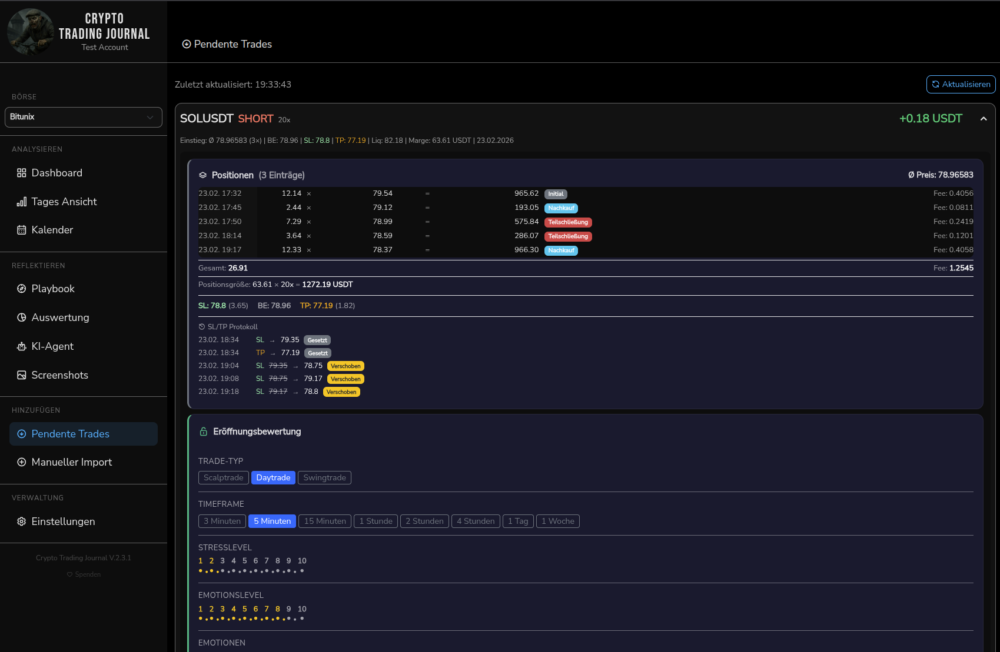

# Crypto Trading Journal

A local, privacy-focused trading journal for **crypto futures trading** — Bitunix and Bitget. No cloud, no accounts, no subscriptions. Run it on your machine or in Docker.

> **Hinweis:** Die Benutzeroberfläche ist komplett auf **Deutsch** (optional Englisch).

## Screenshots




---

## Features

### Dashboard & Analytics
- **P&L Overview** — total profit/loss, win rate, profit factor, ROI%, equity curve
- **Account Balance** — auto-calculated from start deposit + trade P&L, or fetched via exchange API
- **Performance Heatmap** — weekday × hour grid showing when you win and lose
- **Trade-Type Statistics** — Scalp / Day Trade / Swing profitability comparison
- **Strategy-Tag Statistics** — per-strategy P&L and win rate analysis
- **Fees Chart** — per-symbol breakdown of trading vs funding fees
- **Trading Volume** — 30-day and lifetime volume tracking
- **Card Visibility Toggle** — show/hide individual dashboard cards

### Calendar & Daily View
- **Calendar Heatmap** — visual overview of daily P&L across months
- **Daily Summary** — per-day performance with candlestick charts (OHLCV)
- **Trade Blotter** — all fills and executions, grouped by minute with expandable details
- **Screenshot Thumbnails** — inline previews of attached screenshots

### Playbook (Trade Journal)
- **Trade Evaluation** — tags, stress level (1–10), emotion level (1–10), notes
- **Rich Text Notes** — Quill editor for detailed trade analysis
- **Screenshots** — entry, exit, and trend screenshots with annotation support (MarkerJS2)
- **Fill History** — minute-grouped executions with closing/partial/entry badges
- **SL/TP Protocol** — stop loss and take profit tracking with quantity display
- **Auto Trade-Type Detection** — automatic Scalp/Day/Swing classification based on duration

### Auswertung (Evaluation)
- **Strategy Analysis** — performance per strategy tag group
- **Satisfaction Rate** — trading satisfaction/confidence gauge
- **Journal Completeness Radar** — tracks which fields are filled vs empty
- **Stress & Emotion Charts** — over time, correlated with win rate
- **Long/Short Ratio** — distribution analysis

### Incoming Positions (Real-time)
- **Live Position Monitoring** — real-time fetch via broker API with auto-polling
- **AI Trade Ratings** — automatic opening and closing evaluations
- **Strategy Adherence** — "Did I follow my plan?" evaluation at trade closure
- **Trade Transfer** — convert closed position to trade with full metadata transfer

### Share Cards
- **AI-Generated Trade Cards** — shareable images for social media
- **Image Providers** — FLUX.2 (Black Forest Labs) or Google Gemini
- **Customizable Prompt** — describe the background you want, AI generates it
- **14 Built-in Templates** — categorized by direction (long/short) and outcome (win/loss)
- **Template Library** — save your own templates from AI generations
- **Overlay Data** — symbol, direction, leverage, P&L, entry/exit, strategy tags, RRR, comment
- **Privacy Option** — hide P&L dollar amounts, show only percentage

### KI-Agent (AI Reports & Chat)
- **Multiple Providers** — Ollama (local), OpenAI, Anthropic, Google Gemini, DeepSeek
- **Report Generation** — monthly, weekly, custom date range with preset templates
- **Trade Review Chat** — per-trade AI follow-up questions in Daily view
- **Screenshot Analysis** — include chart images in AI analysis
- **Token Statistics** — track usage and estimated costs per provider
- **Global AI Toggle** — enable/disable all AI features at once

### Import & Broker Support
- **Bitunix** — CSV export + API integration (positions, balance, trades)
- **Bitget** — CSV + API integration (positions, balance, fills)
- **Encrypted API Keys** — AES-256-GCM encryption at rest
- **Auto-Deduplication** — prevents duplicate trade entries on re-import

### Backup & System
- **JSON Backup/Restore** — full database export/import with sensitive data masking
- **Auto-Update** — checks GitHub on startup, one-click update from the sidebar
- **Rollback** — revert to previous version if needed
- **First-Run Setup** — guided initial configuration wizard
- **Multi-Language** — German (default) and English

---

## Tech Stack

| Layer | Technology |
|-------|-----------|
| Frontend | Vue 3 (Composition API), Vue Router, ECharts, Bootstrap (dark theme) |
| Backend | Express.js, Knex.js |
| Database | SQLite (default) or PostgreSQL (optional) |
| Rich Text | Quill |
| Annotations | MarkerJS2 |
| CSV | PapaParse |
| Dates | Day.js |
| AI Image | FLUX.2, Google Gemini |

---

## Installation

### Option A: Local (recommended for development)

#### Requirements

- [Node.js 20+](https://nodejs.org/) (LTS recommended)
- [Git](https://git-scm.com/) (required for installation and auto-updates)
- Python 3 + Build Tools (for native npm modules)

#### Linux / macOS

```bash
git clone https://github.com/Mouses007/Crypto-Trading-Journal.git
cd Crypto-Trading-Journal
chmod +x install.sh
./install.sh
npm start
```

Or manually:

```bash
npm install
npm run build
npm start
```

> **macOS**: Double-click `install-mac.command`, `start-mac.command`, `update-mac.command`. Install build tools with `xcode-select --install`.

#### Windows

1. Download or clone this repository
2. Double-click **`install.bat`** — checks all prerequisites:
   - **Node.js 20+** — [Download](https://nodejs.org/)
   - **Git** — [Download](https://git-scm.com/download/win) (required for updates)
   - **Python 3** — [Download](https://www.python.org/downloads/) (check "Add to PATH")
   - **Visual Studio Build Tools** — [Download](https://aka.ms/vs/17/release/vs_BuildTools.exe) (select "Desktop development with C++")
   - Missing components can be auto-installed via winget
3. Double-click **`start.bat`** — starts the server and opens the browser

Open `http://localhost:8080` in your browser.

### Option B: Docker

#### Requirements

- Docker and Docker Compose

#### Quick Start (with external PostgreSQL)

```bash
git clone https://github.com/Mouses007/Crypto-Trading-Journal.git
cd Crypto-Trading-Journal
cp .env.example .env
```

Edit `.env` with your database credentials:

```env
CTJ_PORT=8080
CTJ_SECRET=           # optional: openssl rand -hex 32 (for shared encryption across instances)
DB_TYPE=postgresql
DB_HOST=192.168.178.100
DB_PORT=5432
DB_USER=tradejournal
DB_PASSWORD=your_password
DB_NAME=tradejournal
```

```bash
docker compose up -d
```

Open `http://localhost:8080` in your browser.

#### Docker Commands

```bash
docker compose up -d          # Start
docker compose down            # Stop
docker compose logs -f journal # Logs
docker compose ps              # Status
```

#### NAS Deployment (Synology etc.)

Build and export the image on your development machine, then import it on the NAS:

```bash
docker compose build
docker save journal-journal:latest | gzip > journal-image.tar.gz
```

Copy `journal-image.tar.gz` and a compose file (without `build:`) to your NAS, import the image, and create a project in Container Manager. See [DOCKER.md](DOCKER.md) for details.

---

## Update

Your database is preserved during every update. Git is required for all update methods.

### In-App Update (recommended)

When a new version is available, an **update button** appears in the sidebar (green, between version number and donate link). Click it to automatically fetch, install, rebuild, and restart.

### Manual Update (Local)

```bash
git fetch origin master
git reset --hard origin/master
npm install
npm run build
npm start
```

### Docker Update

```bash
git pull
docker compose up -d --build
```

### Windows (Manual)

Double-click **`update.bat`** — creates a backup and updates automatically.

---

## Configuration

### Port and Host

Default: port `8080`, bound to `127.0.0.1` (local only).

```bash
CTJ_PORT=3000 npm start                  # Different port
CTJ_HOST=0.0.0.0 npm start               # Network access
```

### Database

**SQLite** (default): No configuration needed. Database file `tradenote.db` in project root.

**PostgreSQL**: Create a `db-config.json` in the project root:

```json
{
  "client": "pg",
  "host": "localhost",
  "port": 5432,
  "database": "cryptojournal",
  "user": "youruser",
  "password": "yourpassword"
}
```

For Docker, configure via `.env` instead (see Installation > Docker).

### Encryption (CTJ_SECRET)

By default, API keys are encrypted with a machine-specific seed. If you run multiple instances (e.g., local + Docker) sharing the same database, set `CTJ_SECRET` so all instances use the same encryption key:

```bash
# Generate a secret
openssl rand -hex 32

# Set it as environment variable
export CTJ_SECRET=your_generated_secret

# Or add to .env (for Docker and server_neustart.sh)
CTJ_SECRET=your_generated_secret
```

> **Important**: After setting CTJ_SECRET for the first time, re-enter your broker API keys in Settings — the old keys were encrypted with the previous machine seed.

### Development

```bash
npm run dev
```

Starts the Vite dev server with Hot Module Replacement on port 39482, proxied through the Express backend on port 8080.

---

## Usage

1. Go to **Einstellungen** (Settings) and configure your broker API Key + Secret
2. Import trades via **CSV upload** or **API fetch**
3. Evaluate your trades in **Playbook** — add tags, stress/emotion levels, notes
4. Review your performance in **Dashboard** and **Auswertung**
5. Use the **KI-Agent** for AI-powered trade analysis
6. Generate **Share Cards** to share your trades on social media

---

## Attribution

Based on [TradeNote](https://github.com/Eleven-Trading/TradeNote) by eleven.trading, substantially modified:

- Replaced MongoDB/Parse Server with SQLite/PostgreSQL (Knex)
- Removed cloud auth, payments, analytics; simplified to single-user
- Multi-broker support (Bitunix + Bitget) with encrypted API key storage
- Added: KI-Agent, Share Cards, Incoming Positions, Performance Heatmap, Trade-Type Statistics, Backup/Restore, Auto-Update, Docker support, and more

## License

GPL-3.0 — see [LICENSE](LICENSE) file.
