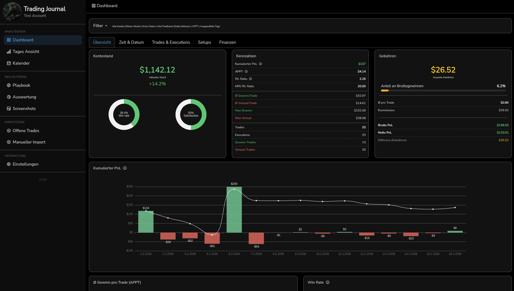
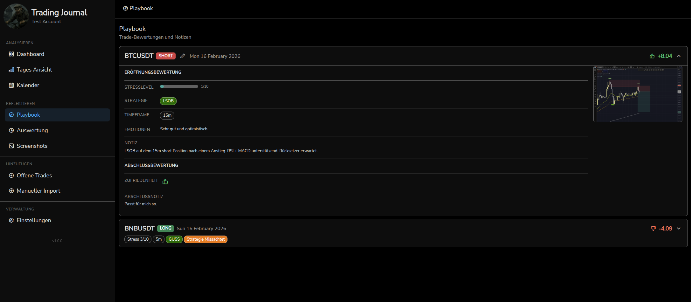

# Crypto Trading Journal

A local, trading journal for **crypto futures trading** (Bitunix, Bitget). No cloud, no accounts — just run it on your machine.

> **Hinweis:** Die Benutzeroberfläche ist komplett auf **Deutsch**.

## Screenshots





## Features

- **Dashboard** with P&L analytics, win rate, profit factor, account balance tracking, and more
- **Multi-Broker** — Bitunix and Bitget support (CSV + API import), broker-separated data
- **Playbook** for trade notes with stress level (1-10) and emotion level (1-10)
- **Auswertung** (Evaluation) with tag-based strategy analysis, stress/emotion charts, and completeness radar
- **Calendar** view of daily trading performance
- **Daily View** for detailed per-day trade analysis
- **Screenshots** with annotation support (broker-separated)
- **Incoming Positions** — track and evaluate open trades in real-time via exchange API
- **CSV and API Import** from Bitunix and Bitget
- **KI-Agent** — AI reports and chat (Ollama, OpenAI, Anthropic, Gemini, DeepSeek)
- **Auto-Update** — checks GitHub for new releases on startup, one-click update from the app
- **Account Balance** — auto-calculated from start deposit + trade P&L, or loaded from exchange API
- **First-Run Setup** — guided initial configuration

## Tech Stack

- **Frontend**: Vue 3 (Composition API), Vue Router, ECharts, Bootstrap (dark theme)
- **Backend**: Express.js with **Knex** — SQLite (default) or optional PostgreSQL
- **Database**: Local `tradenote.db` (SQLite) by default. Optional: PostgreSQL via `db-config.json`
- **Security**: Session cookie for API access; broker API keys encrypted at rest

## Installation

### Requirements

- [Node.js 20+](https://nodejs.org/) (LTS recommended)
- [Git](https://git-scm.com/) (required for installation and auto-updates)
- Python 3 + Build-Tools (for native npm modules)

### Linux / macOS

```bash
git clone https://github.com/Mouses007/Crypto-Trading-Journal.git
cd Crypto-Trading-Journal
chmod +x install.sh
./install.sh
npm start
```

Or manually:

```bash
npm install
npm run build
npm start
```

> **macOS**: Additionally there are `install-mac.command`, `start-mac.command` and `update-mac.command` (double-click). Install build tools with `xcode-select --install`. Python 3 is pre-installed.

### Windows

1. Download or clone this repository
2. Double-click `install.bat` — automatically checks all prerequisites:
   - **Node.js 20+** — [Download](https://nodejs.org/)
   - **Git** — [Download](https://git-scm.com/download/win) (required for updates)
   - **Python 3** — [Download](https://www.python.org/downloads/) (check "Add to PATH" during install)
   - **Visual Studio Build Tools** — [Download](https://aka.ms/vs/17/release/vs_BuildTools.exe) (select "Desktop development with C++")
   - If anything is missing, the installer shows download links and can auto-install via winget
3. Double-click `start.bat` — starts the server and opens the browser

Open `http://localhost:8080` in your browser.

## Update

Your database (`tradenote.db`) is preserved during every update. Git is required for all update methods.

### In-App Update (recommended)

When a new version is available, an **update button** appears in the sidebar (green, between version number and donate link). Click it to automatically fetch the latest code from GitHub, install dependencies, and rebuild. The server restarts automatically.

> **How it works:** The app runs `git fetch origin master` + `git reset --hard origin/master` + `npm install` + `npm run build`. This also works on fresh installations without prior commits.

### Manual Update

```bash
git fetch origin master
git reset --hard origin/master
npm install
npm run build
npm start
```

### Windows (Manual)

Double-click `update.bat` — creates a DB backup and updates automatically via Git.

## Configuration

### Port and Host

Default port is `8080`, bound to `127.0.0.1` (local only). Examples:

```bash
CTJ_PORT=3000 npm start
CTJ_HOST=0.0.0.0 npm start   # Network access (e.g., from other devices)
```

### Database

Default: SQLite (`tradenote.db` in project root). For PostgreSQL, create a `db-config.json`:

```json
{
  "client": "pg",
  "host": "localhost",
  "port": 5432,
  "database": "cryptojournal",
  "user": "youruser",
  "password": "yourpassword"
}
```

### Development (Dev Mode)

```bash
npm run dev
```

Starts the Vite dev server with Hot Module Replacement.

## Usage

1. Go to **Einstellungen** (Settings) and configure your broker API Key + Secret
2. Import trades via **CSV upload** or **API fetch**
3. Evaluate your trades in **Playbook** — add tags, stress/emotion levels, notes
4. Review your performance in **Dashboard** and **Auswertung**
5. Use the **KI-Agent** for AI-powered trade analysis (requires Ollama, OpenAI, or other provider)

## Attribution

This project is based on [TradeNote](https://github.com/Eleven-Trading/TradeNote) by eleven.trading, substantially modified:

- Replaced MongoDB/Parse Server with SQLite (optional PostgreSQL via Knex)
- Removed Docker, cloud auth, payments, analytics
- Simplified to single-user; multi-broker support (Bitunix + Bitget)
- Session-cookie API auth; encrypted storage for broker API keys
- Added emotion level tracking, tag-based strategy evaluation, incoming positions
- Added KI-Agent (AI reports via Ollama/OpenAI/Anthropic/Gemini/DeepSeek)
- Added auto-update system with GitHub release checking
- Added account balance tracking with exchange API integration

## License

GPL-3.0 — see [LICENSE](LICENSE) file.
