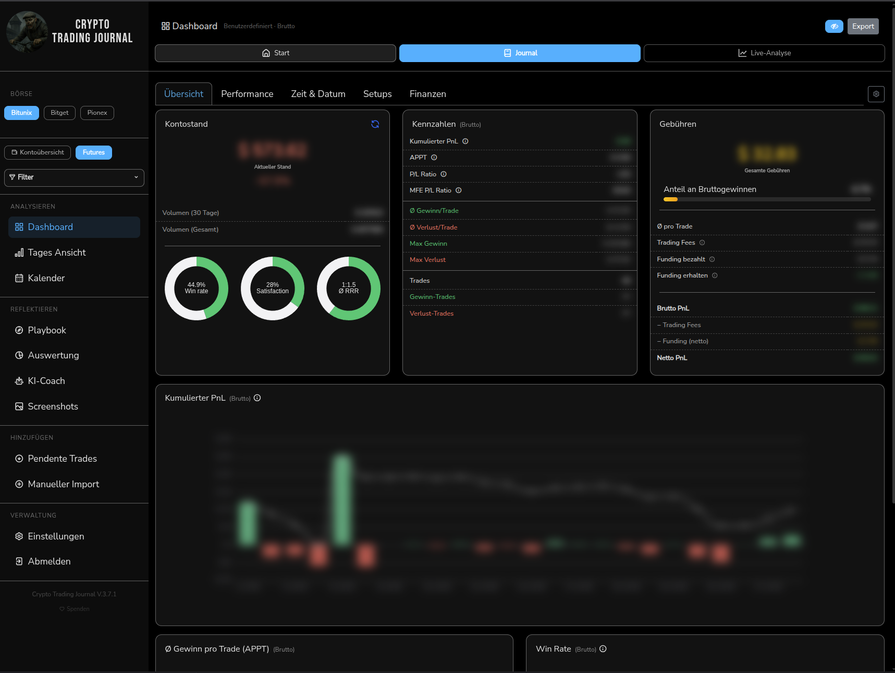
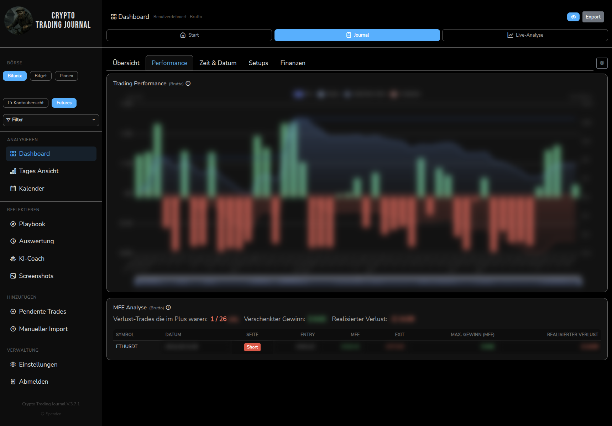
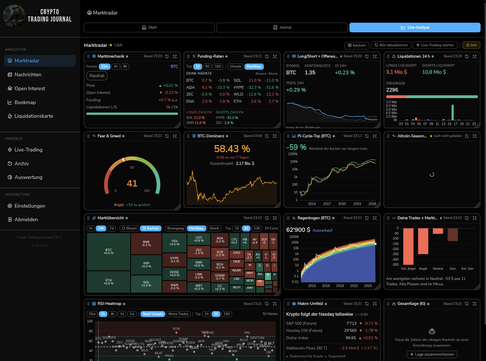
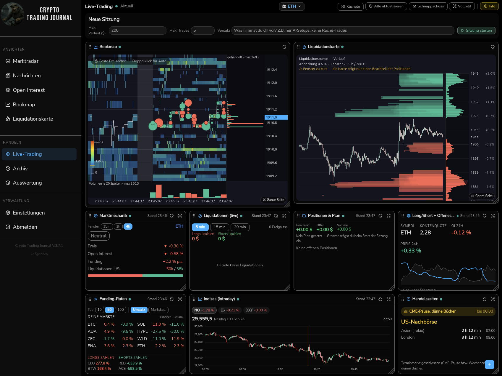
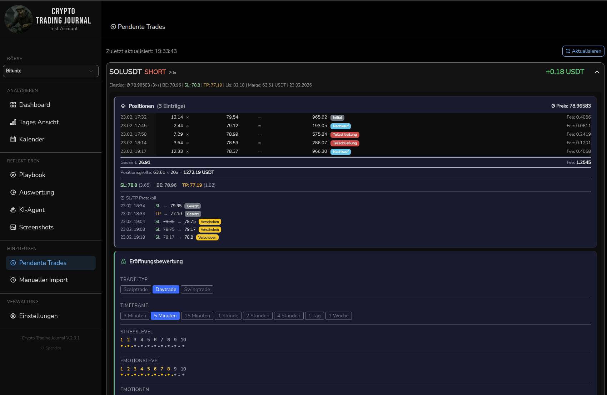

# Crypto Trading Journal

A **free**, self-hosted, open-source trading journal for **crypto futures** on **Bitunix**, **Bitget** and **Pionex**.
Runs locally or via Docker — no cloud, no account, no subscription.
Vue 3 + Express, SQLite or PostgreSQL, GPL-3.0.

  

> Available in Linux Mint: **System Settings → Desklets → Download → "Trading Positions"**
> The user interface is available in **German** (default) and **English**.

## Screenshots











---

## Features

### Dashboard & Analytics
- **P&L Overview** — total profit/loss, win rate, profit factor, ROI%, equity curve
- **Account Balance** — auto-calculated from start deposit + trade P&L, or fetched via exchange API
- **Performance Heatmap** — weekday × hour grid showing when you win and lose
- **Trade-Type Statistics** — Scalp / Day Trade / Swing profitability comparison
- **Strategy-Tag Statistics** — per-strategy P&L and win rate analysis
- **Fees Chart** — per-symbol breakdown of trading vs funding fees
- **Trading Volume** — 30-day and lifetime volume tracking
- **Card Visibility Toggle** — show/hide individual dashboard cards

### Nachrichten (Live-Analyse)

- **AI briefing**: one German report from all sources — not one summary per post, styled like a newspaper article with a chapter per selected topic (crypto / finance / tech), selectable length (short/medium/long) and a daily, weekly (weekday selectable) or manual-only rhythm. During the day it can be followed by one or two **interim notes** at hours you pick: the AI searches your sources and the web for what has come in since the briefing — news, figures, decisions, dates relevant to crypto and trading — and reports only that, shorter than the briefing and without repeating it. The crypto chapter opens with the journal's own Marktradar measurements (Fear & Greed, dominance, funding, long/short). Written by your configured provider; YouTube videos are watched by Gemini first (the only provider that opens a video URL) and summarized as bullet points; with a Perplexity key the report additionally researches each topic on the web, with an xAI key X accounts are fetched via Grok. Every point opens up to the posts it is based on, so nothing is unverifiable. Reports are archived — browse, reopen and delete old ones.
- **Sources**: YouTube channels, RSS feeds (e.g. Yahoo Finance), public Telegram channels and X accounts (via Grok). "Temporär ausschliessen" hides sources you marked — and does not even fetch them. The keyword-based "Ruhe-Filter" additionally drops Truth Social automatically plus any post containing your keywords (e.g. a person's name), from both the list and the briefing.
- **Economic calendar**: adjustable range, impact and currency areas. ForexFactory covers the current week; the Fed's own calendar adds its meeting dates months ahead.
- Costs are shown before you press: the briefing estimates its own price from your settings.

### Marktradar (Live-Analyse)

- Tile grid with the market situation at a glance — show/hide, drag to reorder, drag the corner to resize, click to enlarge (all stored per device)
- **Fear & Greed** with full history, **BTC dominance** (TradingView chart + own daily recording), **funding rates** (your markets first), **long/short + open interest**, **RSI scatter** over the top 10/50/100 markets or your own traded symbols
- **Market overview** as bubbles or treemap, **rainbow chart** with self-computed regression bands, **Pi Cycle Top** with an adjustable alarm (on the crossing itself, or already at a set distance)
- **24h liquidations** from the journal's own recording — no paid third party involved
- **Your trades × market regime**: your win rate and P&L grouped by the Fear & Greed value of each entry day
- **BTC dominance** with six years of history for Bitcoin, Ethereum and everything else — from our own stored data, no third-party embed
- **Overall picture (AI)**: one button turns everything the other tiles currently show into a five-line read — a market state, three to four points, the contradictions between the tiles and what to watch. The AI only ever sees the readings from the tiles (they are listed under "Basis" in the enlarged view), it looks nothing up and gives no trading recommendation. Nothing is generated without pressing the button.
- Only crypto: Binance perpetuals are filtered to actual coins, so tokenised equities and commodities never show up

### Hype-Radar and Coin-Radar (Entdecken)

Two radars asking opposite questions, sharing one watchlist.

**Hype-Radar — what is new out there, and what of it has substance?** Collects young
coin projects from CoinGecko, DexScreener and GeckoTerminal, scores them from five
sub-scores, then filters hard for scam patterns (GoPlus, RugCheck on Solana:
honeypot, mint authority, holder concentration) *before* an AI writes a report about
the few survivors. The number of independent sources weighs heaviest — a paid
campaign fills one source, rarely three. A divergence quadrant plots attention
against market confirmation, so bought noise becomes visible where a sorted list
would hide it. Searching is free; the report costs a few cents to about a franc.

**Coin-Radar — which of the tradable coins can be traded best right now?** Walks the
~500 pairs that are tradable on Bitunix and measurable on Binance and ranks them by
**ATR %** (does it move enough), **RVOL** (is something going on, measured against
the coin's *own* average), **ADX** (trending or chopping) and **funding**
(annualised, inverted — expensive holding costs points). Liquidity is a **gate, not
a sub-score**: below 10M USD turnover or above 5 basis points spread a coin never
enters the ranking, because high movement in an illiquid pair only means every order
moves the price itself. Typically seventy to ninety pairs survive.

A **second, separate score** answers the other half: execution quality. For every
survivor the real order book is fetched from Bitunix **and** Bitget and the cost
of a 5,000 USD order computed — buy and sell separately, because a book that
makes entry cheap and exit expensive is a trap no average reveals. The cheaper
venue is named per coin, and the differences are large (measured: TREE cost 5
basis points on Bitunix and 54 on Bitget). The two scores sit side by side and
are never merged — "moves a lot" and "trades cheaply" are two questions. Pionex
is absent from this measurement because no public order-book endpoint is
verified for it — not, as previously stated here, for lack of perpetuals: it
runs 602 of them. It appears in the exchange filter, just not in the execution
figures.

**Outcome tracking**: for the top twenty of every run, what actually happened
afterwards is recorded — 15m/1h/4h for the Coin Radar, 1/7/30 days for the Hype
Radar. What is measured is the span between best and worst point, not the
return, and it is compared against the bottom half of the list. Without that
control group, on a busy day even a random ranking looks brilliant. The weights
are not auto-optimised against it.

The page states plainly what it does *not* claim: direction. It carries into the
present because volatility is persistent — it comes in phases lasting weeks to
months — while direction is not. Every run therefore also reports its own rank
correlation with the previous run: near 1 the list holds, near 0 it is noise, and
then the page says so. A run takes about forty seconds and costs nothing; only the
short AI paragraph above the table costs about a cent and can be switched off.
Automation is off out of the box.

**Shared favourites and watchdog** — the star in either list feeds the same watchlist,
checked on its own schedule (default every 15 minutes) and delivered via the in-app
alarm list, ntfy, Telegram or a webhook (e.g. Home Assistant, to flash a light). The
rules differ by origin: for hype finds price jump, daily move, liquidity drain and a
newly failing safety check; for Coin-Radar favourites price jump, daily move,
turnover collapse, widening spread and extreme funding — a Bitunix perpetual has no
liquidity pool that could drain.

### Live-Trading window (Live-Analyse)

A second tile grid, separate from the Marktradar — the workspace for the two to
four hours actually spent trading. Its own layout, its own tile selection, a
three-second check interval instead of thirty.

Starting a session opens it in **its own browser window**, without side menu and
without navigation, with a button for real fullscreen. During a session nothing
else should be one mouse move away — that is the same idea as writing the plan
down beforehand. **Desktop only**: eleven tiles, an order book and a candle
chart cannot be operated on a phone, and a tool that only half works leads to
decisions on half the information. Can be switched off entirely under
Settings → Live; then the start button, the menu entry and the page all
disappear.

- **Trading hours** — which session is running (Asia / London / US pre-market / cash / after-hours), a countdown to the next mark, and an explicit red band for the windows that are *bad* to trade: five minutes before to fifteen after the US cash open, the macro-data and FOMC slots (only when the calendar actually carries an event), the close, and the daily CME break. Every session is computed in its own time zone — the US and EU switch to summer time weeks apart, so a fixed local time is wrong two to three times a year.
- **Indices intraday** — ES, NQ and the dollar index as five-minute candles with the previous close and a marker on the US open. Futures, not cash indices: the cash index stands still exactly when you are trading crypto.
- **Liquidations (live)** — the last few minutes rather than the last 24 hours, from the journal's own recording, Binance and Bybit shown separately. Binance throttles to one event per second per symbol, so those numbers are a sample; Bybit does not. If the recording is switched off, the tile says so — an empty ticker must never look like a quiet market.
- **Events** — only what is due in the next hours, with a countdown. If your country and impact filter removes everything, the tile says how many events it hid instead of showing an empty list.
- **Positions & plan** — open positions, realised and unrealised P&L kept strictly apart, and two bars showing how much of your plan is used up. The bars count the **realised** loss only; a floating drawdown must not throw you out of a position that is still turning.
- **Bookmap and liquidation map as tiles** — the same components as their own pages, embedded. No enlarging here: the enlarged view would be a second instance and therefore a second market-data connection, so there is a "full page" link instead. The liquidation map runs on a daytrading setting (24 h instead of the page's own window) without touching what you configured on the page itself.
- **Coin selector centred in the header** — the symbol drives the whole page: bookmap, liquidation map, mechanics, long/short and the AI read all follow it. It may change during a session; every switch is recorded in the session log.

### Trading sessions — archive and evaluation

Before a session you write down what you intend: maximum loss, maximum number
of trades, and an intent in one line. During the session the plan stays visible
but locked. At the end you add a verdict, and the journal freezes which trades
were closed inside the window, what they made, and whether the plan held.

The point is the last part. A winning session that broke its loss limit was
luck; a losing one that stayed inside its limits was good work — and no other
view in the journal makes that difference visible. Sessions survive a reload and
a server restart, only one can run at a time, and a forgotten one can be closed
without being evaluated. Where an order-book recording covers the window, one
click replays the Bookmap over exactly that period.

Old sessions can be archived rather than deleted. They drop out of the list but
stay in the tally — a discipline figure you could improve by tidying up would
not be worth reading.

The **evaluation** page asks four questions of those sessions, building on each
other: do I keep my plan and am I improving, does the plan help at all, at which
times of day and week do I trade well, and does it turn with session length or
trade count. Groups with fewer than four sessions are greyed out rather than
presented as a finding — three sessions on a Tuesday are noise.

### Calendar & Daily View
- **Calendar Heatmap** — visual overview of daily P&L across months
- **Daily Summary** — per-day performance with candlestick charts (OHLCV)
- **Trade Blotter** — all fills and executions, grouped by minute with expandable details
- **Screenshot Thumbnails** — inline previews of attached screenshots

### Playbook (Trade Journal)
- **Trade Evaluation** — tags, stress level (1–10), emotion level (1–10), notes
- **Rich Text Notes** — Quill editor for detailed trade analysis
- **Screenshots** — entry, exit, and trend screenshots with annotation support (MarkerJS2)
- **Fill History** — minute-grouped executions with closing/partial/entry badges
- **SL/TP Protocol** — stop loss and take profit tracking with quantity display
- **Auto Trade-Type Detection** — automatic Scalp/Day/Swing classification based on duration

### Auswertung (Evaluation)
- **Strategy Analysis** — performance per strategy tag group
- **Satisfaction Rate** — trading satisfaction/confidence gauge
- **Journal Completeness Radar** — tracks which fields are filled vs empty
- **Stress & Emotion Charts** — over time, correlated with win rate
- **Long/Short Ratio** — distribution analysis

### Incoming Positions (Real-time)
- **Live Position Monitoring** — real-time fetch via broker API with auto-polling
- **AI Trade Ratings** — automatic opening and closing evaluations
- **Strategy Adherence** — "Did I follow my plan?" evaluation at trade closure
- **Trade Transfer** — convert closed position to trade with full metadata transfer

### Share Cards
- **AI-Generated Trade Cards** — shareable images for social media
- **Image Providers** — FLUX.2 (Black Forest Labs) or Google Gemini
- **Customizable Prompt** — describe the background you want, AI generates it
- **14 Built-in Templates** — categorized by direction (long/short) and outcome (win/loss)
- **Template Library** — save your own templates from AI generations
- **Overlay Data** — symbol, direction, leverage, P&L, entry/exit, strategy tags, RRR, comment
- **Privacy Option** — hide P&L dollar amounts, show only percentage

### KI-Agent (AI Reports & Chat)
- **Multiple Providers** — Ollama (local), OpenAI, Anthropic, Google Gemini, DeepSeek
- **Report Generation** — monthly, weekly, custom date range with preset templates
- **Trade Review Chat** — per-trade AI follow-up questions in Daily view
- **Autonomous Agent** — chat agent that queries your journal data on its own, reads the current Marktradar readings, and answers questions about using the app itself (built-in documentation); quick-access button in the top navigation
- **Screenshot Analysis** — include chart images in AI analysis
- **Token Statistics** — track usage and estimated costs per provider
- **Global AI Toggle** — enable/disable all AI features at once

### Import & Broker Support
- **Bitunix** — CSV export + API integration (positions, balance, trades)
- **Bitget** — CSV + API integration (positions, balance, fills)
- **Pionex** — API integration (futures and grid-bot trades)
- **Encrypted API Keys** — AES-256-GCM encryption at rest
- **Auto-Deduplication** — prevents duplicate trade entries on re-import

### Backup & System
- **JSON Backup/Restore** — full database export/import with sensitive data masking
- **Auto-Update** — checks GitHub on startup, one-click update from the sidebar
- **Rollback** — revert to previous version if needed
- **First-Run Setup** — guided initial configuration wizard
- **Multi-Language** — German (default) and English
- **Extended info** — a small "i" next to values and controls; hover (tap on phones) explains what the number means. Switchable off in one place for the whole app (Settings → General → Layout & Style); button labels and the full info panels at the top of each page stay either way.
- **Switch modes off** — every mode except the journal can be turned off individually (Übersicht, Live-Analyse, Research, Strategien). Off means off, not hidden: the tab disappears, the side menu renders nothing, and even a direct link leads back to the journal. For anyone who only wants the journal.

---

## Companion apps

Your open positions outside the browser — all three companions live in this repo:

- **Android home-screen widget** ([android-widget/](android-widget/)) — open positions and P&L on your phone, per-exchange KPIs, configurable refresh. Built with Gradle; see its README for the build script.
- **Linux Mint / Cinnamon desklet** ([desklet/](desklet/)) — positions directly on the desktop. Published in the official [Cinnamon Spices](https://cinnamon-spices.linuxmint.com/desklets) repository: install it from **System Settings → Desklets → Download → "Trading Positions"**. The copy in this repo is the source; `desklet/install.sh` installs it locally for development.
- **ESP32 hardware displays** ([ESP32-2432S028/](ESP32-2432S028/), [ESP32-Waveshare/](ESP32-Waveshare/)) — a cheap always-on display next to your monitor, fed by a read-only endpoint protected with its own API key (PlatformIO projects).

---

## Tech Stack

| Layer | Technology |
|-------|-----------|
| Frontend | Vue 3 (Composition API), Vue Router, ECharts, Bootstrap (dark theme) |
| Backend | Express.js, Knex.js |
| Database | SQLite (default) or PostgreSQL (optional) |
| Rich Text | Quill |
| Annotations | MarkerJS2 |
| CSV | PapaParse |
| Dates | Day.js |
| AI Image | FLUX.2, Google Gemini |

---

## Installation

### Option A: Local (recommended for development)

#### Requirements

- [Node.js 20+](https://nodejs.org/) (LTS recommended)
- [Git](https://git-scm.com/) (required for installation and auto-updates)
- Python 3 + Build Tools (for native npm modules)

#### Linux / macOS

```bash
git clone https://github.com/Mouses007/Crypto-Trading-Journal.git
cd Crypto-Trading-Journal
chmod +x install.sh
./install.sh
npm start
```

Or manually:

```bash
npm install
npm run build
npm start
```

> **macOS**: Double-click `install-mac.command`, `start-mac.command`, `update-mac.command`. Install build tools with `xcode-select --install`.

#### Windows

1. Download or clone this repository
2. Double-click **`install.bat`** — checks all prerequisites:
   - **Node.js 20+** — [Download](https://nodejs.org/)
   - **Git** — [Download](https://git-scm.com/download/win) (required for updates)
   - **Python 3** — [Download](https://www.python.org/downloads/) (check "Add to PATH")
   - **Visual Studio Build Tools** — [Download](https://aka.ms/vs/17/release/vs_BuildTools.exe) (select "Desktop development with C++")
   - Missing components can be auto-installed via winget
3. Double-click **`start.bat`** — starts the server and opens the browser

Open `http://localhost:8080` in your browser.

### Option B: Docker

#### Requirements

- Docker and Docker Compose

#### Quick Start (with external PostgreSQL)

```bash
git clone https://github.com/Mouses007/Crypto-Trading-Journal.git
cd Crypto-Trading-Journal
cp .env.example .env
```

Edit `.env` with your database credentials:

```env
CTJ_PORT=8080
CTJ_SECRET=           # optional: openssl rand -hex 32 (for shared encryption across instances)
DB_TYPE=postgresql
DB_HOST=192.168.178.100
DB_PORT=5432
DB_USER=tradejournal
DB_PASSWORD=your_password
DB_NAME=tradejournal
```

```bash
docker compose up -d
```

Open `http://localhost:8080` in your browser.

#### Docker Commands

```bash
docker compose up -d          # Start
docker compose down            # Stop
docker compose logs -f journal # Logs
docker compose ps              # Status
```

#### NAS Deployment (Synology etc.)

The image is published on Docker Hub, so the NAS pulls it directly — no build step:

```bash
docker compose pull && docker compose up -d
```

Copy `docker-compose.yml` and your `.env` to the NAS and create a project in Container Manager. See [DOCKER.md](DOCKER.md) for details.

**HTTPS for LAN access**: `docker-compose.yml` includes an optional Caddy container that terminates TLS with a self-issued [mkcert](https://github.com/FiloSottile/mkcert) certificate — needed for the browser's Notification permission prompt, which Chrome refuses on plain HTTP (except `localhost`). Purely additive; port 8080/HTTP keeps working unchanged. See [DOCKER.md](DOCKER.md#https-für-den-lan-zugriff-caddy--mkcert) for setup.

---

## Update

Your database is preserved during every update. Git is required for all update methods.

### In-App Update (recommended)

When a new version is available, an **update button** appears in the sidebar (green, between version number and donate link). Click it to automatically fetch, install, rebuild, and restart.

### Manual Update (Local)

```bash
git fetch origin master
git reset --hard origin/master
npm install
npm run build
npm start
```

### Docker Update

```bash
git pull
docker compose up -d --build
```

### Windows (Manual)

Double-click **`update.bat`** — creates a backup and updates automatically.

---

## Configuration

### Port and Host

Default: port `8080`, bound to `127.0.0.1` (local only).

```bash
CTJ_PORT=3000 npm start                  # Different port
CTJ_HOST=0.0.0.0 npm start               # Network access
```

### Database

**SQLite** (default): No configuration needed. Database file `tradenote.db` in project root.

**PostgreSQL**: Create a `db-config.json` in the project root:

```json
{
  "client": "pg",
  "host": "localhost",
  "port": 5432,
  "database": "cryptojournal",
  "user": "youruser",
  "password": "yourpassword"
}
```

For Docker, configure via `.env` instead (see Installation > Docker).

### Encryption (CTJ_SECRET)

By default, API keys are encrypted with a machine-specific seed. If you run multiple instances (e.g., local + Docker) sharing the same database, set `CTJ_SECRET` so all instances use the same encryption key:

```bash
# Generate a secret
openssl rand -hex 32

# Set it as environment variable
export CTJ_SECRET=your_generated_secret

# Or add to .env (for Docker and server_neustart.sh)
CTJ_SECRET=your_generated_secret
```

> **Important**: After setting CTJ_SECRET for the first time, re-enter your broker API keys in Settings — the old keys were encrypted with the previous machine seed.

### Development

```bash
npm run dev
```

Starts the Vite dev server with Hot Module Replacement on port 39482, proxied through the Express backend on port 8080.

---

## Usage

1. Go to **Einstellungen** (Settings) and configure your broker API Key + Secret
2. Import trades via **CSV upload** or **API fetch**
3. Evaluate your trades in **Playbook** — add tags, stress/emotion levels, notes
4. Review your performance in **Dashboard** and **Auswertung**
5. Use the **KI-Agent** for AI-powered trade analysis
6. Generate **Share Cards** to share your trades on social media

---

## Attribution

Based on [TradeNote](https://github.com/Eleven-Trading/TradeNote) by eleven.trading, substantially modified:

- Replaced MongoDB/Parse Server with SQLite/PostgreSQL (Knex)
- Removed cloud auth, payments, analytics; simplified to single-user
- Multi-broker support (Bitunix + Bitget) with encrypted API key storage
- Added: KI-Agent, Share Cards, Incoming Positions, Performance Heatmap, Trade-Type Statistics, Backup/Restore, Auto-Update, Docker support, and more

## License

GPL-3.0 — see [LICENSE](LICENSE) file.
